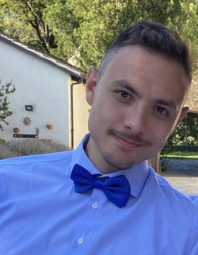

**Alessio Debernardi Venon**

Software Engineer @ [eDreams ODIGEO](https://www.edreamsodigeo.com/)

[Linkedin](https://www.linkedin.com/in/alessio-debernardi-venon/) /
[GitHub](https://github.com/alessiodebernardi)

# Why this space?
I like to take notes and make schemes about the things I learn during my daily activities, to fix them in my mind and to have a reference for the future. I also like to read them from time to time to refresh my memory.
So I decided to (or at least try to) translate them into a blog, to hopefully make them useful for other people too.
Also, English is not my first language, so this is a good opportunity to keep myself trained and improve it.

Any suggestions are welcome!
